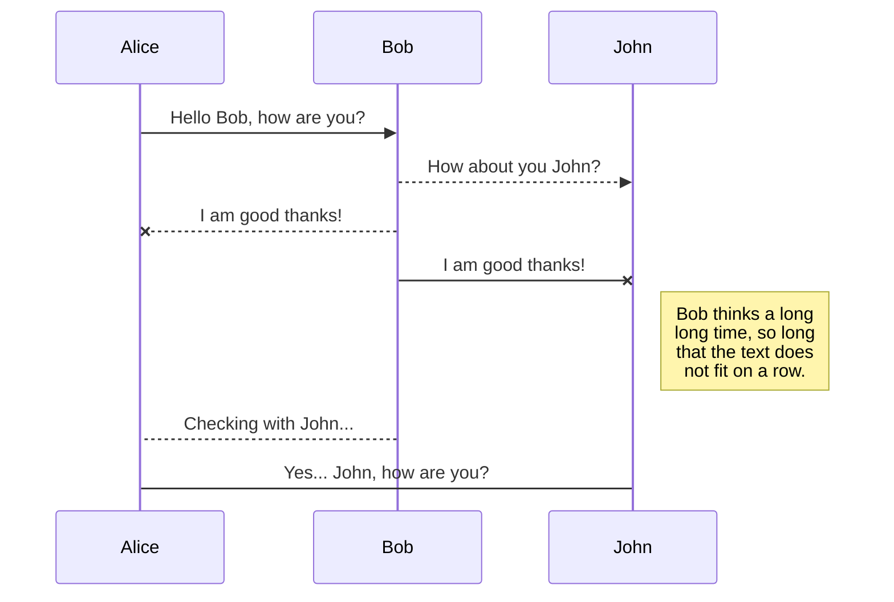
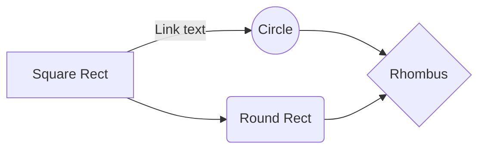

## 🐶 The Doggy Time
**I started The Doggy Time app to learn how to upload apps to the AppStore to consolidate what I've learned so far and create a good reference in my portfolio, and I love dogs.**

## 🦴 About App

-  🦮 There is information on over +70 dog breeds.
-  📝 More than +199 male and female dog names available.
-  🥕 Contains detailed information about vegetables and fruits that dogs can eat.
-  ❤️ You can add dog breed and name to favorites.
-  🌄 You can find pictures suitable for dog names with random pictures.

-  ✈️ You can access and download the application App Store: **[The Doggy Time](https://github.com/Batuhanirmali)**

-  How to reach me **[📩](batuirmali@gmail.com)**

-  I hope you like my app **waiting for your comments 😊**

## 🚀 Language and libraries:
-  **[Swift (UIKIT)](https://www.swift.org)**
- **[Cocoa Pods, ProgressHUD](https://github.com/relatedcode/ProgressHUD)**
- **[Kingfisher](https://github.com/onevcat/Kingfisher)**

 

## APPLICATION DIAGRAM

 
You can render UML diagrams using [Mermaid](https://mermaidjs.github.io/). For example, this will produce a sequence diagram:

And this will produce a flow chart:

